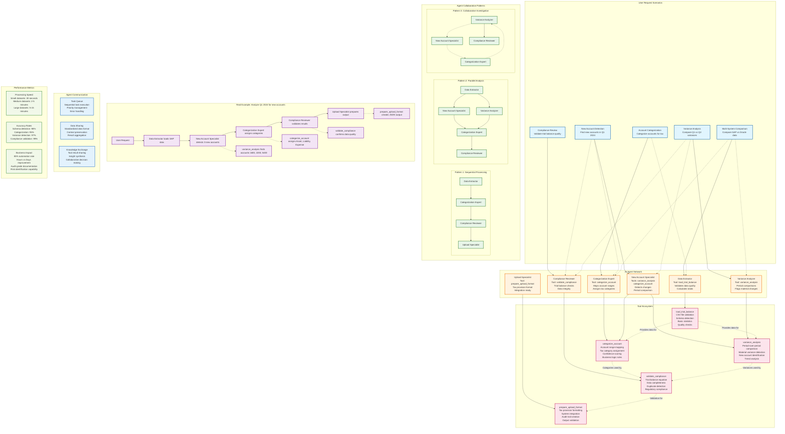

```mermaid 

graph TB
    %% User Scenarios
    subgraph UserScenarios["User Request Scenarios"]
        S1["New Account Detection<br/>Find new accounts in Q1 2024"]
        S2["Variance Analysis<br/>Compare Q1 vs Q2 variances"]
        S3["Account Categorization<br/>Categorize accounts for tax"]
        S4["Multi-System Comparison<br/>Compare SAP vs Oracle data"]
        S5["Compliance Review<br/>Validate trial balance quality"]
    end
    
    %% Agent Network
    subgraph AgentNetwork["AI Agent Network"]
        A1[Data Extractor<br/>Tool: load_trial_balance<br/>Validates data quality<br/>Calculates totals]
        A2[Categorization Expert<br/>Tool: categorize_account<br/>Maps account ranges<br/>Assigns tax categories]
        A3[New Account Specialist<br/>Tools: variance_analysis<br/>categorize_account<br/>Detects changes<br/>Period comparison]
        A4[Variance Analyzer<br/>Tool: variance_analysis<br/>Period comparisons<br/>Flags material changes]
        A5[Compliance Reviewer<br/>Tool: validate_compliance<br/>Trial balance checks<br/>Data integrity]
        A6[Upload Specialist<br/>Tool: prepare_upload_format<br/>Tax provision format<br/>Integration ready]
    end
    
    %% Collaboration Patterns
    subgraph CollaborationPatterns["Agent Collaboration Patterns"]
        
        subgraph Pattern1["Pattern 1: Sequential Processing"]
            P1A[Data Extractor] --> P1B[Categorization Expert] --> P1C[Compliance Reviewer] --> P1D[Upload Specialist]
        end
        
        subgraph Pattern2["Pattern 2: Parallel Analysis"]
            P2A[Data Extractor] --> P2B[New Account Specialist]
            P2A --> P2C[Variance Analyzer]
            P2B --> P2D[Categorization Expert]
            P2C --> P2D
            P2D --> P2E[Compliance Reviewer]
        end
        
        subgraph Pattern3["Pattern 3: Collaborative Investigation"]
            P3A[Variance Analyzer] -.-> P3B[New Account Specialist]
            P3B -.-> P3C[Categorization Expert]
            P3C -.-> P3A
            P3A --> P3D[Compliance Reviewer]
        end
    end
    
    %% Tool Ecosystem
    subgraph ToolEcosystem["Tool Ecosystem"]
        T1[load_trial_balance<br/>CSV file validation<br/>Schema detection<br/>Basic statistics<br/>Quality checks]
        
        T2[categorize_account<br/>Account range mapping<br/>Tax category assignment<br/>Confidence scoring<br/>Business logic rules]
        
        T3[variance_analysis<br/>Period-over-period comparison<br/>Material variance detection<br/>New account identification<br/>Trend analysis]
        
        T4[validate_compliance<br/>Trial balance equation<br/>Data completeness<br/>Duplicate detection<br/>Regulatory compliance]
        
        T5[prepare_upload_format<br/>Tax provision formatting<br/>System integration<br/>Audit trail creation<br/>Output validation]
    end
    
    %% Scenario-Agent Mapping
    S1 --> A3
    S2 --> A4
    S3 --> A2
    S4 --> A1
    S5 --> A5
    
    %% Cross-scenario collaboration
    S1 -.-> A2
    S1 -.-> A5
    S2 -.-> A3
    S2 -.-> A5
    S3 -.-> A1
    S4 -.-> A4
    S4 -.-> A2
    
    %% Agent-Tool Mapping
    A1 --> T1
    A2 --> T2
    A3 --> T3
    A3 --> T2
    A4 --> T3
    A5 --> T4
    A6 --> T5
    
    %% Tool Interdependencies
    T1 -.->|Provides data for| T2
    T1 -.->|Provides data for| T3
    T2 -.->|Categories used by| T4
    T3 -.->|Variances used by| T4
    T4 -.->|Validation for| T5
    
    %% Real Example Flow
    subgraph RealExample["Real Example: Analyze Q1 2024 for new accounts"]
        E1[User Request] --> E2[Data Extractor loads SAP data]
        E2 --> E3[New Account Specialist detects 3 new accounts]
        E3 --> E4[Categorization Expert assigns categories]
        E4 --> E5[Compliance Reviewer validates results]
        E5 --> E6[Upload Specialist prepares output]
        
        E3 -.-> E7[variance_analysis finds accounts 1600, 2200, 5400]
        E4 -.-> E8[categorize_account assigns Asset, Liability, Expense]
        E5 -.-> E9[validate_compliance confirms data quality]
        E6 -.-> E10[prepare_upload_format creates JSON output]
    end
    
    %% Agent Communication Protocols
    subgraph Communication["Agent Communication"]
        C1[Task Queue<br/>Sequential task execution<br/>Priority management<br/>Error handling]
        
        C2[Data Sharing<br/>Standardized data format<br/>Context preservation<br/>Result aggregation]
        
        C3[Knowledge Exchange<br/>Tool result sharing<br/>Insight synthesis<br/>Collaborative decision making]
    end
    
    %% Performance Metrics
    subgraph Metrics["Performance Metrics"]
        M1[Processing Speed<br/>Small datasets: 30 seconds<br/>Medium datasets: 2-5 minutes<br/>Large datasets: 5-15 minutes]
        
        M2[Accuracy Rates<br/>Schema detection: 98%<br/>Categorization: 95%<br/>Variance detection: 97%<br/>Compliance validation: 99%]
        
        M3[Business Impact<br/>85% automation rate<br/>Hours vs Days improvement<br/>Audit-grade documentation<br/>Risk identification capability]
    end
    
    %% Styling
    classDef scenario fill:#e1f5fe,stroke:#01579b,stroke-width:2px
    classDef agent fill:#fff3e0,stroke:#ef6c00,stroke-width:2px
    classDef tool fill:#fce4ec,stroke:#c2185b,stroke-width:2px
    classDef pattern fill:#e8f5e8,stroke:#2e7d32,stroke-width:2px
    classDef example fill:#f3e5f5,stroke:#7b1fa2,stroke-width:2px
    classDef communication fill:#e3f2fd,stroke:#1565c0,stroke-width:2px
    classDef metrics fill:#f1f8e9,stroke:#388e3c,stroke-width:2px
    
    class S1,S2,S3,S4,S5 scenario
    class A1,A2,A3,A4,A5,A6 agent
    class T1,T2,T3,T4,T5 tool
    class P1A,P1B,P1C,P1D,P2A,P2B,P2C,P2D,P2E,P3A,P3B,P3C,P3D pattern
    class E1,E2,E3,E4,E5,E6,E7,E8,E9,E10 example
    class C1,C2,C3 communication
    class M1,M2,M3 metrics

```